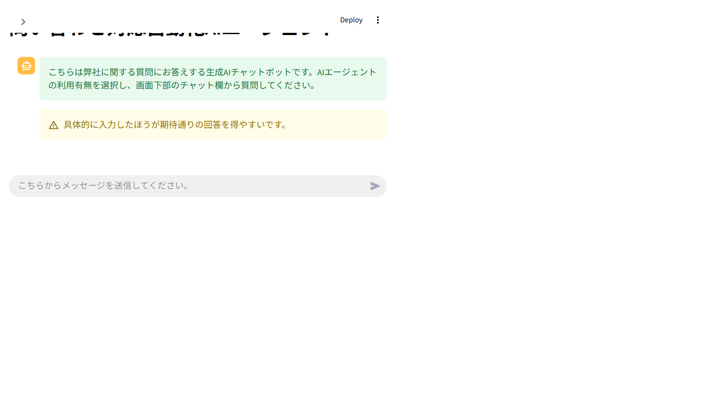

# 問い合わせ対応自動化AIエージェント

社内文書を参照して、顧客からの問い合わせに回答する Streamlit ベースのチャットアプリです。RAG による文書検索と、必要に応じた AI エージェント機能を組み合わせて回答を生成します。


## 画面キャプチャ




## 使い方

1. 画面左側のサイドバーで、AI エージェント機能を「利用する」または「利用しない」から選びます。
2. 画面下部のチャット欄に質問を入力して送信します。
3. 回答が表示されたら、内容に応じて「はい」または「いいえ」でフィードバックを送れます。
4. 「いいえ」を選んだ場合は、理由を入力して送信できます。

## 主な機能

- 社内文書を参照した問い合わせ回答
- AI エージェント機能の利用有無を切り替え可能
- 回答に対するフィードバック送信
- 会話ログとエラーログの保存
- PDF / DOCX / TXT の文書を検索対象として利用

## 動作環境

- Python 3.11 系
- Windows または macOS
- OpenAI API キー
- SerpApi API キー

## セットアップ

1. 仮想環境を作成して有効化します。
2. 依存関係をインストールします。

```bash
pip install -r requirements_windows.txt
```

macOS の場合は次を使います。

```bash
pip install -r requirements_mac.txt
```

3. プロジェクト直下に `.env` を用意し、必要な環境変数を設定します。

```env
OPENAI_API_KEY=your_openai_api_key
SERPAPI_API_KEY=your_serpapi_api_key
```

## 起動方法

```bash
streamlit run main.py
```

起動後はブラウザが開き、画面上のチャット欄から質問できます。

## データ配置

検索対象の文書は `data` 配下に配置します。

- `data/company`
- `data/service`
- `data/customer`

対応している拡張子は `.pdf`、`.docx`、`.txt` です。

## 生成されるファイル

初回起動時や検索データ更新時に、次のローカルデータベースが再生成されます。

- `.db_all`
- `.db_company`
- `.db_service`
- `.db_customer`

ログは `logs/` 配下に出力されます。

## 補足

- AI エージェント機能を有効にすると、回答生成に時間がかかる場合があります。
- 文書に含まれていない内容は推測せず、見つからなかった旨を回答します。
- 文書を更新した場合は、再起動してベクトルデータベースを再構築してください。